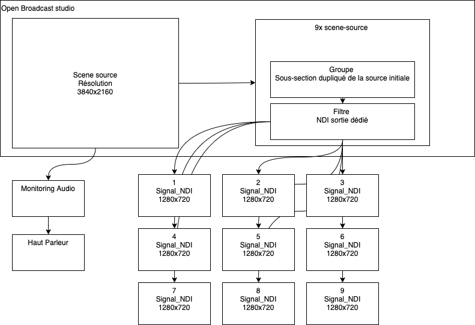
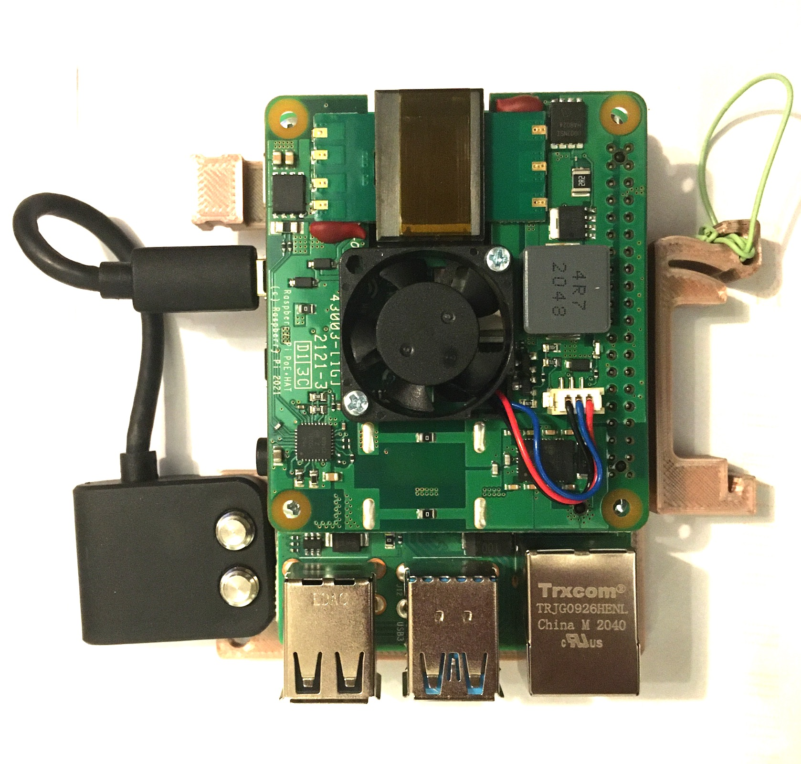
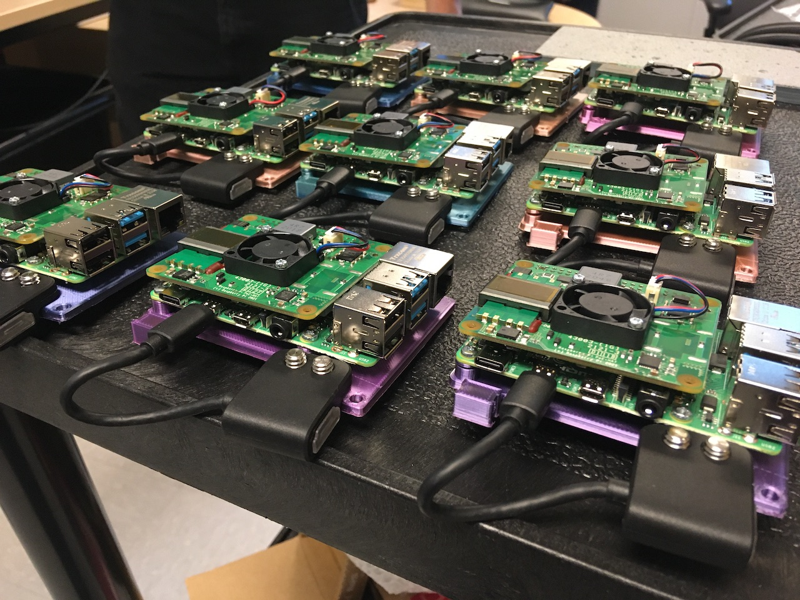

# dispositif-9-sorties

* Système de diffusion mozaique à 9 écrans (9x 720p) 

## Fonctionnement 

* À partir d'un vidéo 4k (3840x2160), 9 sorties NDI indépendantes, 9 lecteurs indépendant. 
* La source est chargé dans un logiciel de lecture libre (Open Broadcast studio)
* Utilise un système de micro ordinateur (raspberry pi) pour afficher les signal sur de moniteur vidéo
* Utilise le POE pour alimenter les micro ordinateurs ainsi que les écrans 
* L'ensemble du matériel est monté sur des rails dins afin de permettre une reconfiguration aisé 

### Installation 

* [installation](docs/install.md)

### Flux de signaux

## Calibration 

### Calibration 9 écrans

### Calibration 1 écran

## Assemblage 

### Integration

### Branchement 

### Composantes 

| qte       |  objet                    | ref       |
|---        |---                        |---        |
|  9        | Moniteur vidéo            | 1080p          |
|  9        | Kit Raspberry pi POE DIN  |           |
|  1        | Ordinateur central        | OBS       | 
|  5        | Rails Din                 |           |
|  2        | Commutateurs eternet POE  |           |
|           |                           |           |

## Configuration 

### Raspberry

#### à partir de raspberry pi OS Debian Buster

suivre ces instructions : https://dicaffeine.com/raspbian

### Open Broadcast studio

#### OBS NDI

https://github.com/Palakis/obs-ndi

### Documentation visuelle

#### Kit Pi POE

#### Flotte de PI POE en cours d'assemblage

