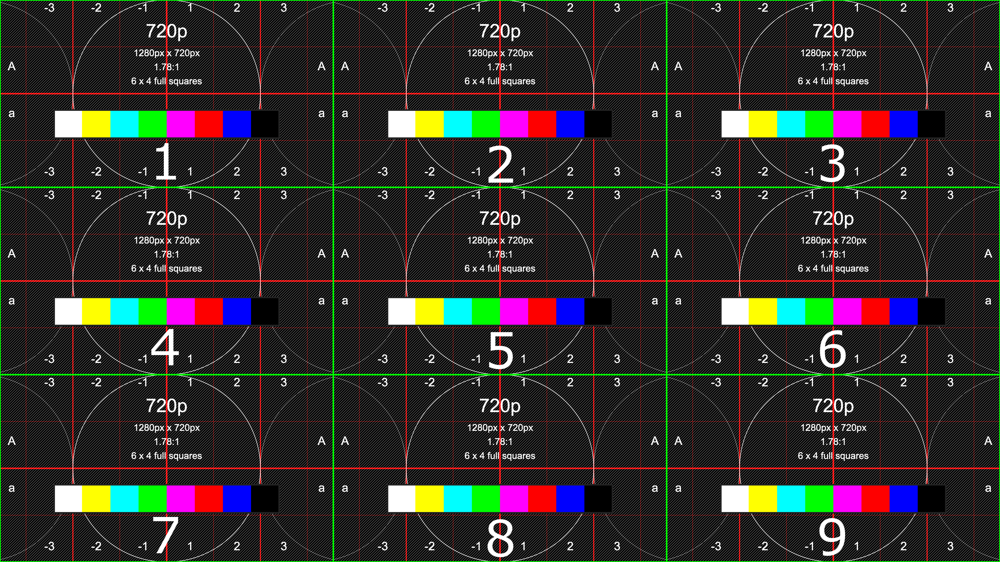
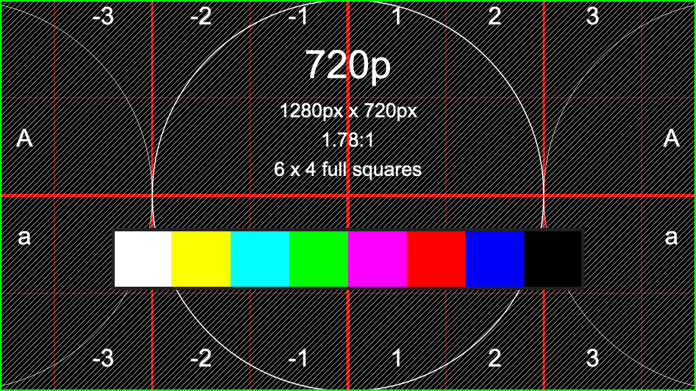
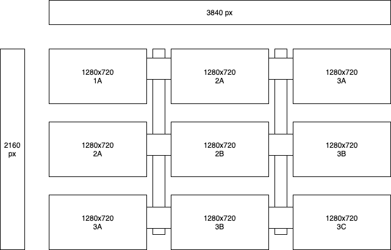
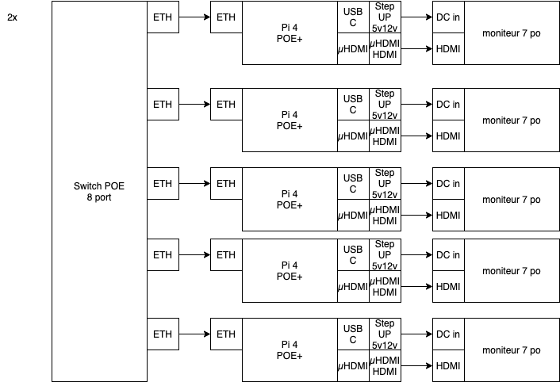

# dispositif-9-sorties
Système de diffusion à 9 écrans (9x 720p)

## Calibration 

### Calibration 9 écrans

* 

### Calibration 1 écran

* 

## Assemblage 

### Integration

* 

### Branchement 
* 